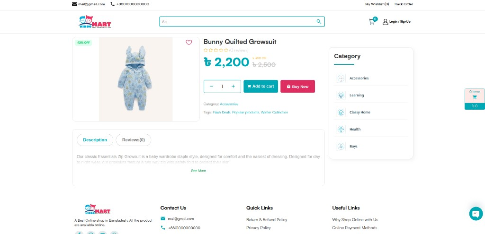
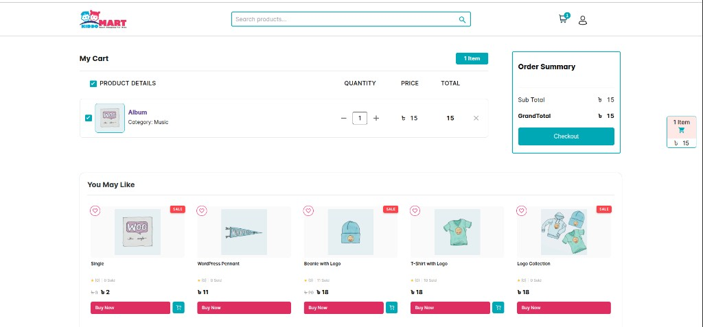
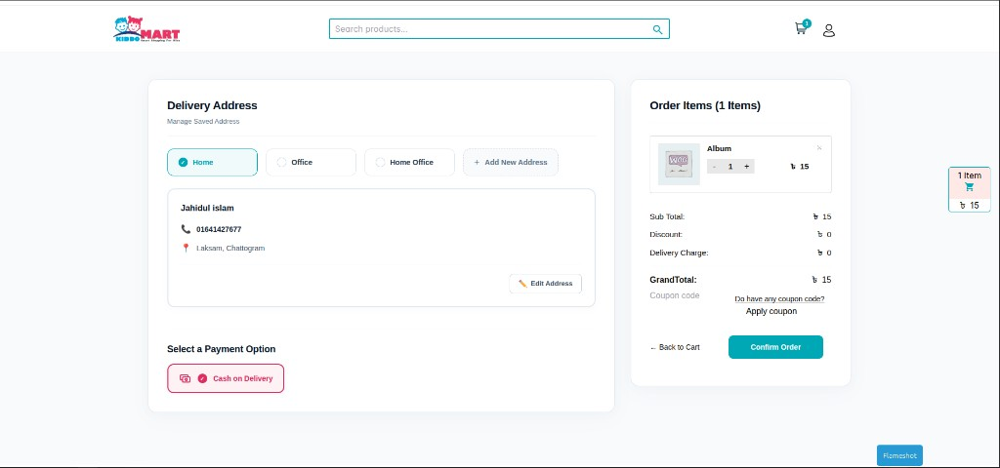
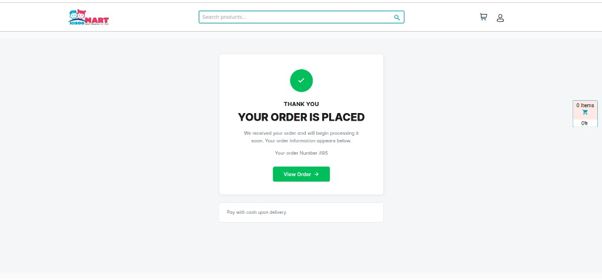
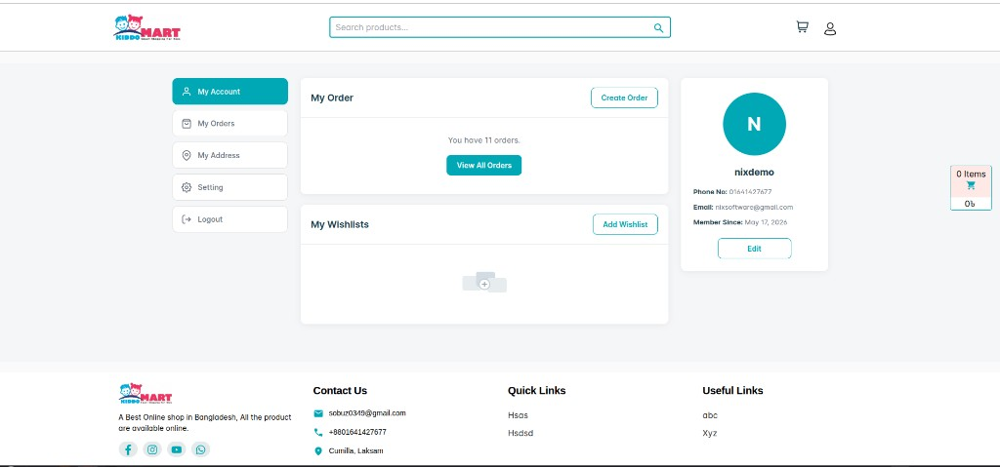
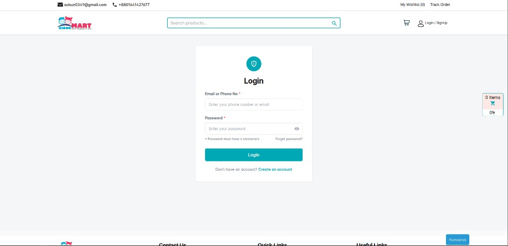
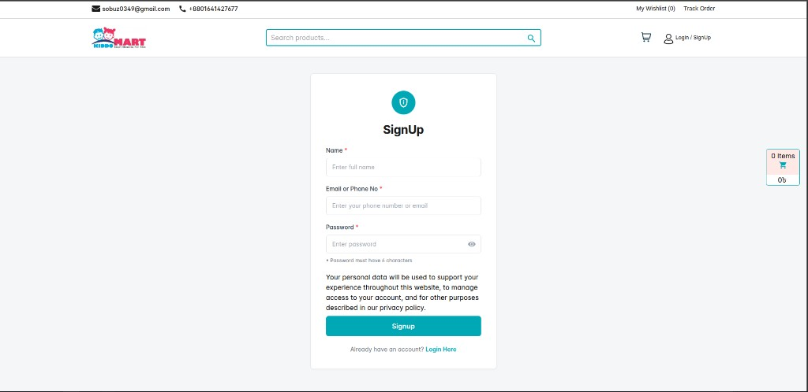

# Kids Shop — Theme Documentation

**Theme Name:** Kids Shop  
**Version:** 1.0.0  
**Author:** MD Jahidul Islam Sabuz  
**Theme URI:** [github.com/coderjahidul/kids-shop](https://github.com/coderjahidul/kids-shop)  
**Text Domain:** `kids-shop`  
**Requires:** WordPress 6.0+, PHP 8.0+, WooCommerce 6.0+ (recommended)  
**Tested up to:** WordPress 6.8

Kids Shop is a modern, lightweight WooCommerce theme for kids fashion, baby products, toys, and online retail. It includes responsive layouts, customizable shop features, and admin **Theme Settings** for branding, home page content, and store behavior—without editing code.

---

## Screenshots

A full walkthrough of the Kids Shop storefront. Logo, colors, contact details, and home content are editable from **Appearance → Theme Settings** — no code required.

### Quick navigation

| Storefront | Shopping | Account & auth |
|:-----------|:---------|:---------------|
| [Home page](#screenshot-home) | [Cart](#screenshot-cart) | [My Account](#screenshot-my-account) |
| [Single product](#screenshot-product) | [Checkout](#screenshot-checkout) | [Login](#screenshot-login) |
| | [Thank you](#screenshot-thank-you) | [Sign up](#screenshot-signup) |

### At a glance

<p align="center">
  <a href="#screenshot-home"></a>
  <a href="#screenshot-product"></a>
</p>
<p align="center">
  <a href="#screenshot-cart"></a>
  <a href="#screenshot-checkout"></a>
</p>
<p align="center">
  <a href="#screenshot-thank-you"></a>
  <a href="#screenshot-my-account"></a>
  <a href="#screenshot-login"></a>
</p>

<br />

---

### Storefront

<a id="screenshot-home"></a>

#### 1. Home page

Hero slider · category grid · configurable product rows (Flash Deals, collections, and more)

<p align="center">
  
</p>

<p align="center"><sub>↑ Responsive header, search, mini-cart, and mobile-friendly category chips</sub></p>

<br />

<a id="screenshot-product"></a>

#### 2. Single product

Sale badges · BDT pricing · quantity · Add to cart & Buy Now · description & reviews tabs · category sidebar

<p align="center">
  
</p>

<p align="center"><sub>↑ WooCommerce product layout with custom styling and related categories</sub></p>

<br />

---

### Shopping flow

<a id="screenshot-cart"></a>

#### 3. Cart

Line items · quantity +/- · subtotal · **Checkout** CTA · recommended products

<p align="center">
  
</p>

<p align="center"><sub>↑ Sticky order summary and “You May Like” product strip</sub></p>

<br />

<a id="screenshot-checkout"></a>

#### 4. Checkout

Saved addresses · Cash on Delivery · order review · coupons · **Confirm Order**

<p align="center">
  
</p>

<p align="center"><sub>↑ Bangladesh-friendly address fields (division, phone, full address)</sub></p>

<br />

<a id="screenshot-thank-you"></a>

#### 5. Order confirmation

Clear success state · order number · **View Order** button · COD payment note

<p align="center">
  
</p>

<p align="center"><sub>↑ Order-received page with branded confirmation UI</sub></p>

<br />

---

### Account & authentication

<a id="screenshot-my-account"></a>

#### 6. My Account

Dashboard · orders summary · wishlist · profile card · sidebar navigation

<p align="center">
  
</p>

<p align="center"><sub>↑ Custom WooCommerce account layout (orders, address, settings, logout)</sub></p>

<br />

<a id="screenshot-login"></a>

#### 7. Login

Email or phone · password toggle · forgot password · link to sign up

<p align="center">
  
</p>

<p align="center"><sub>↑ Themed login (front-end links use <code>/login/</code> instead of <code>wp-login.php</code>)</sub></p>

<br />

<a id="screenshot-signup"></a>

#### 8. Sign up

Name · email/phone · password · privacy notice · WooCommerce registration

<p align="center">
  
</p>

<p align="center"><sub>↑ Matching sign-up UI at <code>/signup/</code> when customer registration is enabled</sub></p>

<br />

> **Tip:** Replace demo branding in screenshots with your own logo and colors under **Theme Settings → General** and **Colors**.

---

## Table of Contents

1. [Screenshots](#screenshots)
2. [Requirements](#requirements)
3. [Installation](#installation)
4. [Initial Setup](#initial-setup)
5. [Theme Settings](#theme-settings)
6. [Home Page](#home-page)
7. [Shop & Products](#shop--products)
8. [Cart & Checkout](#cart--checkout)
9. [Customer Accounts](#customer-accounts)
10. [Login & Sign Up](#login--sign-up)
11. [Menus & Footer](#menus--footer)
12. [Colors & Branding](#colors--branding)
13. [Template Structure](#template-structure)
14. [Hooks & Filters (Developers)](#hooks--filters-developers)
15. [File Reference](#file-reference)
16. [Troubleshooting](#troubleshooting)

---

## Requirements

| Component | Notes |
|-----------|--------|
| **WordPress** | 6.0 or newer (tested up to 6.8) |
| **PHP** | 8.0 or newer |
| **WooCommerce** | Required for shop, cart, checkout, and account features |
| **MySQL / MariaDB** | Standard WordPress database |

Optional but recommended:

- SSL certificate (checkout and account pages)
- Product categories with meaningful slugs (used by home sections)
- Bangladesh-focused shipping zones (checkout defaults to country `BD`)

---

## Installation

1. Upload the `kids-shop` folder to `/wp-content/themes/`, or install via **Appearance → Themes → Add New → Upload Theme**.
2. Activate **Kids Shop** under **Appearance → Themes**.
3. Install and activate **WooCommerce** if it is not already active.
4. Complete the [Initial Setup](#initial-setup) steps below.
5. Open **Appearance → Theme Settings** (or use the **Theme Settings** link on the Themes screen) to configure the store.

---

## Initial Setup

### WooCommerce pages

Ensure WooCommerce has created and assigned these pages under **WooCommerce → Settings → Advanced**:

| Page | Typical slug |
|------|----------------|
| Shop | `shop` |
| Cart | `cart` |
| Checkout | `checkout` |
| My account | `my-account` |

The theme overrides cart, checkout, thank-you, and my-account templates with custom layouts in `woocommerce/`.

### Front page

1. Create a static page (e.g. “Home”) or use an existing one.
2. Go to **Settings → Reading**.
3. Set **Your homepage displays** to **A static page** and choose that page as **Homepage**.

The theme uses `front-page.php`, which renders the hero slider, category grid, and configurable product sections.

### Login & Sign Up pages

On theme activation, the theme attempts to create two pages automatically:

| Slug | Template | Purpose |
|------|----------|---------|
| `login` | `page-login.php` | Customer login (replaces `wp-login.php` for front-end links) |
| `signup` | `page-signup.php` | Customer registration |

If these pages are missing, switch the theme off and on again, or create pages manually with those exact slugs.

**WooCommerce:** Enable customer registration under **WooCommerce → Settings → Accounts & Privacy** if you want sign-up to work on the themed signup page.

### Permalinks

After activation, visit **Settings → Permalinks** and click **Save Changes** once to flush rewrite rules.

---

## Theme Settings

Open: **Appearance → Theme Settings**  
Capability required: `manage_options` (Administrator)

Settings are stored in the WordPress option `kids_shop_theme_options`. Tabs save independently; fields on other tabs are preserved via hidden inputs when you save one tab.

### General

| Setting | Description |
|---------|-------------|
| **Header logo** | Logo in the site header. Falls back to Site logo if empty. |
| **Footer logo** | Logo in the footer. Falls back to Site logo if empty. |
| **Site logo (fallback)** | Used when header or footer logo is not set. |
| **Logo alt text** | Accessibility text for logo images. |
| **Footer description** | Short text under the footer logo. |
| **Copyright line** | Supports `{year}` and `{site}` placeholders. `{site}` becomes a link to the home page. |
| **Site name in copyright** | Overrides the WordPress site title in `{site}`. |
| **“Powered by” link** | Optional name and URL; leave name empty to hide the line. |
| **Quick Links / Useful Links** | Column headings and optional **Appearance → Menus** assignments. |
| **Header search** | Placeholder, empty-results message, mobile search button label. |
| **Mobile search suggestions** | One keyword per line; rotates in the mobile header search area. |

**Footer menus:** Assign menus under **Appearance → Menus**, then select them in Theme Settings. Choose **Default (built-in links)** to keep hard-coded footer links from the exported markup.

### Contact & Social

| Setting | Description |
|---------|-------------|
| **Email, Phone, Address** | Shown in the header top bar and footer. |
| **Facebook, Instagram, YouTube** | Social profile URLs. |
| **WhatsApp number** | Include country code (e.g. `+8801000000000`). Used for the floating WhatsApp link. |

### Colors

| Setting | CSS variable | Default |
|---------|--------------|---------|
| **Primary (teal)** | `--shop-color-primary` | `#27A7B8` |
| **Secondary (pink)** | `--shop-color-secondary` | `#D12C60` |
| **Tertiary accent** | `--shop-color-tertiary` | `#e8007c` |

Colors are output as inline CSS on `:root` and `html` in the document head.

### Hero Slider

- Up to **12 slides**.
- Each slide needs an **uploaded image** (Media Library). Slides without an image do not appear on the home page.
- Optional **Link URL** wraps the slide image.
- Optional **Alt text** for accessibility.
- Images can be saved immediately via AJAX when selected in the admin UI.

### Home Sections

- Up to **12 product rows** on the home page.
- Each section requires a **Title** (shown as the section heading).
- **Product source** options:

| Type | Behavior |
|------|----------|
| **Category products** | Products from a WooCommerce category **slug** (e.g. `winter-collection`). |
| **On sale (Flash Deals)** | Products currently on sale. |
| **Popular / best sellers** | Ordered by popularity. |
| **Featured products** | WooCommerce featured products. |

- **Number of products:** 1–12 per section (default 5).
- **View All button text** and **View All URL** — leave URL empty to auto-link based on source (category archive, sale filter, shop, etc.).

### Shop

| Setting | Description |
|---------|-------------|
| **Products per page** | 4–48 products on shop and category archives (default 12). Overrides WordPress “Blog pages show at most X posts” for product queries. |

---

## Home Page

The front page template (`front-page.php`) includes:

1. **Hero slider** — `template-parts/home/hero-slider.php`  
   Slides from Theme Settings → Hero Slider.

2. **Categories grid** — `template-parts/home/categories-grid.php`  
   WooCommerce product categories.

3. **Product sections** — `template-parts/home/product-section.php`  
   Dynamic rows from Theme Settings → Home Sections.

Product sections use `kids_shop_get_home_product_sections()` and WooCommerce product queries. Empty section lists mean no product rows are shown until you add sections in Theme Settings.

---

## Shop & Products

### Archive layout

- **3 columns** on shop and category pages (filter: `loop_shop_columns`).
- **Category sidebar** — `template-parts/shop/category-sidebar.php`.
- **Product cards** — `template-parts/shop/product-card.php`.
- Body class: `kids-shop-archive` on shop and taxonomy pages.

### Single product

- Template: `woocommerce/single-product.php`, `woocommerce/content-single-product.php`.
- **Related products** — `template-parts/shop/related-products.php`.
- Body class: `kids-shop-single-product-page`.
- AJAX add-to-cart with header cart updates (`assets/shop.js`).

### Search

Header search submits to the WooCommerce shop page with the `s` query parameter. Live search behavior is handled by `inc/header-search.php` and `assets/header-search.js`.

---

## Cart & Checkout

### Cart page

- Custom full-page layout: `woocommerce/cart-page.php`.
- Template parts under `template-parts/cart/`.
- Styles: `assets/kids-shop-cart.css`, scripts: `assets/cart.js`, `assets/shop.js`.
- Header mini-cart and cart page stay in sync via WooCommerce fragments and `kids_shop_get_cart_fragments()`.

### Checkout page

- Custom layout: `woocommerce/checkout-page.php`.
- Simplified billing fields oriented toward **Bangladesh**:
  - **Full Name** (single name field)
  - **Phone Number** (required)
  - **Select Division** (Dhaka, Chattogram, Rajshahi, Khulna, Barishal, Sylhet, Rangpur, Mymensingh)
  - **Full Address** (textarea)
  - Hidden billing country default: `BD`
- Place order button label: **Confirm Order**.
- Logged-in customers can **save multiple addresses** (stored in user meta `_kids_shop_saved_addresses`).
- Checkout AJAX: update line quantities, shipping options fragment refresh.
- Styles: `assets/kids-shop-checkout.css`, `assets/checkout.js`.

### Thank you page

- Custom layout: `woocommerce/thankyou-page.php`.
- Styles: `assets/kids-shop-thankyou.css`.

---

## Customer Accounts

### My Account

- Custom wrapper: `woocommerce/myaccount-page.php`.
- Layout parts: `template-parts/myaccount/`.
- WooCommerce templates overridden under `woocommerce/myaccount/`.
- Styles: `assets/kids-shop-myaccount.css`, `assets/myaccount.js` (logged-in users only).
- Body class: `kids-shop-myaccount-page`.

### Saved addresses

Addresses are stored per user and can be selected at checkout. The first saved address may be migrated from default WooCommerce billing fields as **Home**.

---

## Login & Sign Up

| Page | URL | Features |
|------|-----|----------|
| Login | `/login/` | Themed form; failed logins redirect back with `?login=failed` or `?login=empty` |
| Sign Up | `/signup/` | WooCommerce registration when enabled |

- `login_url` filter points front-end login links to `/login/`.
- Logged-in users visiting login/signup are redirected to **My Account**.
- Styles: `assets/kids-shop-auth.css`, `assets/auth.js`.

---

## Menus & Footer

Register these menu locations under **Appearance → Menus**:

| Location | Description |
|----------|-------------|
| **Footer — Quick Links** | First footer link column |
| **Footer — Useful Links** | Second footer link column |

Assign menus in Theme Settings, or leave as default for built-in links.

Copyright HTML supports `{year}` and `{site}`; optional “Powered by” line from Theme Settings.

---

## Colors & Branding

Brand colors are managed in Theme Settings → Colors and applied globally. The header/footer HTML is buffered and filtered (`kids_shop_filter_header_html`, `kids_shop_filter_footer_html`) so logos, contact info, URLs, and search strings from the exported markup are replaced with your saved options.

Default logo (if none uploaded):  
`assets/gemini-generated-image-dzqentdzqentdzqe-29a1.webp`

---

## Template Structure

```
kids-shop/
├── style.css                 # Theme header + compiled global CSS
├── functions.php             # Setup, enqueues, WooCommerce hooks
├── front-page.php            # Home page
├── header.php / footer.php   # Buffered HTML + wp_head/wp_footer
├── page.php, single.php, archive.php, index.php
├── page-login.php, page-signup.php
├── inc/
│   ├── theme-options.php     # Options API, defaults, accessors
│   ├── theme-settings.php    # Admin Theme Settings UI
│   ├── template-filters.php  # Header/footer HTML replacements
│   ├── home-helpers.php      # Hero + home sections
│   ├── shop-helpers.php      # Shop URLs, product helpers
│   ├── cart-helpers.php      # Cart fragments, display state
│   ├── auth-helpers.php      # Login/signup pages
│   ├── myaccount-helpers.php # Account UI helpers
│   └── header-search.php     # Product search AJAX
├── template-parts/
│   ├── home/                 # Hero, categories, product sections
│   ├── shop/                 # Sidebar, cards, related products
│   ├── cart/                 # Cart items, dropdown, empty state
│   ├── checkout/             # Shipping options, order items
│   ├── auth/                 # Login/signup layout and forms
│   └── myaccount/            # Dashboard, navigation, profile
├── woocommerce/              # WooCommerce template overrides
└── assets/                   # CSS, JS, images, bundled styles
```

### Body classes (useful for CSS)

| Class | When |
|-------|------|
| `kids-shop-home-page` | Front page |
| `kids-shop-archive` | Shop / product taxonomy |
| `kids-shop-single-product-page` | Single product |
| `kids-shop-cart-page` | Cart |
| `kids-shop-checkout-page` | Checkout |
| `kids-shop-thankyou-page-body` | Order received |
| `kids-shop-auth-page-body` | Login or signup |
| `kids-shop-myaccount-page` | My Account |

---

## Hooks & Filters (Developers)

### Filters

| Hook | Purpose |
|------|---------|
| `kids_shop_hero_slides` | Modify hero slides array before render |
| `kids_shop_home_product_sections` | Modify home product section configs |
| `loop_shop_columns` | Column count (theme returns `3`) |
| `loop_shop_per_page` | Products per page from Theme Settings |
| `woocommerce_checkout_fields` | Simplified checkout fields |
| `woocommerce_order_button_text` | “Confirm Order” label |
| `login_url` | Themed login URL |

### Functions (public API)

| Function | Description |
|----------|-------------|
| `kids_shop_get_option( $key, $default )` | Single theme option |
| `kids_shop_get_all_options()` | All options merged with defaults |
| `kids_shop_get_logo_url_for( $context )` | Logo URL (`header` or `footer`) |
| `kids_shop_get_login_url()` | Login page permalink |
| `kids_shop_get_signup_url()` | Signup page permalink |
| `kids_shop_get_hero_slides()` | Front-end hero slides |
| `kids_shop_get_home_product_sections()` | Home section configs + query args |
| `kids_shop_get_whatsapp_url()` | WhatsApp chat link |
| `kids_shop_get_footer_copyright_html()` | Copyright HTML with placeholders |

### Constants

| Constant | Value |
|----------|--------|
| `KIDS_SHOP_OPTIONS_KEY` | `kids_shop_theme_options` |

### Child themes

Use a child theme to override templates or add hooks without losing changes on parent theme updates. Enqueue additional styles with dependency `kids-shop-style`.

---

## File Reference

### Key assets (loaded conditionally)

| File | Loaded on |
|------|-----------|
| `assets/kids-shop-home.css`, `home.js` | Front page |
| `assets/kids-shop-shop.css`, `shop.js` | Shop, product, cart (partial) |
| `assets/kids-shop-cart.css`, `cart.js` | Cart |
| `assets/kids-shop-checkout.css`, `checkout.js` | Checkout |
| `assets/kids-shop-thankyou.css` | Order received |
| `assets/kids-shop-auth.css`, `auth.js` | Login, signup |
| `assets/kids-shop-myaccount.css`, `myaccount.js` | My Account |
| `assets/kids-shop-logo.css`, `kids-shop-header-cart.css` | Global |
| `assets/styles-KX5MWBAA.css` | Bundled layout (via header) |
| `assets/admin-theme-settings.css/js` | Theme Settings admin only |

### WooCommerce overrides

| Template | Role |
|----------|------|
| `archive-product.php` | Shop archive |
| `content-product.php` | Loop product |
| `single-product.php` | Single product shell |
| `cart-page.php` | Full cart page |
| `checkout-page.php` | Full checkout page |
| `thankyou-page.php` | Order confirmation |
| `myaccount-page.php` | Account shell |
| `checkout/form-checkout.php`, `review-order.php` | Checkout form partials |
| `myaccount/*.php` | Account forms and orders |

---

## Troubleshooting

### Hero slider does not appear

- Add at least one slide in **Theme Settings → Hero Slider**.
- Upload an image for each slide and click **Save Changes**.
- Confirm the site’s homepage is set to a static page using `front-page.php`.

### Home product sections are empty

- Add sections in **Theme Settings → Home Sections** with a **Title** and product source.
- For **Category products**, use the exact WooCommerce category **slug**.
- Ensure products exist and match the source (e.g. on sale, featured).

### Shop shows wrong number of products

- Set **Products per page** under **Theme Settings → Shop** (4–48).
- The theme forces this value on `woocommerce_product_query` even if **Settings → Reading** sets a different post count.

### Login / Sign Up 404

- Confirm pages with slugs `login` and `signup` exist and are published.
- Re-save **Settings → Permalinks**.

### Checkout missing divisions or shipping

- Theme expects WooCommerce shipping configured for Bangladesh (`BD` default country).
- Shipping is calculated on `woocommerce_before_checkout_form` using billing address fields.

### Cart count not updating

- Ensure WooCommerce cart fragments are not disabled by another plugin.
- Theme enqueues `wc-cart-fragments` globally on the front end.

### Theme Settings image not saving

- After selecting an image, click **Use this image** in the Media Library.
- For hero slides, wait for the “Image saved” admin notice before saving the full settings form.

---

## Support & Credits

- **Author:** [MD Jahidul Islam Sabuz](https://github.com/coderjahidul)  
- **Repository:** [github.com/coderjahidul/kids-shop](https://github.com/coderjahidul/kids-shop)  
- **License:** GPL v2 or later  
- **Default “Powered by”:** [Nixsoftware](https://nixsoftware.net/) (configurable in Theme Settings)

For code-level changes, prefer child themes and the hooks listed above. For store content, use Theme Settings, WooCommerce, and the block/classic editor as appropriate.
