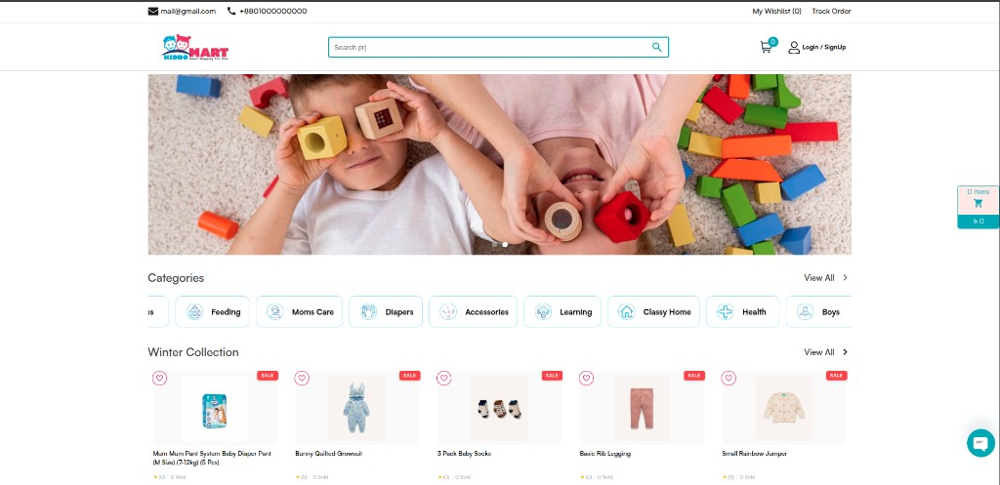

# Kids Shop

A WooCommerce theme for kids and family product stores, with a configurable home page, custom cart/checkout, and admin **Theme Settings**.

## Quick start

1. Install **WooCommerce** and activate this theme.
2. Set a static **Homepage** under **Settings → Reading**.
3. Open **Appearance → Theme Settings** to configure logos, colors, hero slider, and home product sections.
4. Ensure WooCommerce pages (Shop, Cart, Checkout, My Account) exist.

## Preview

  

  <a href="./DOCUMENTATION.md#screenshots"><strong>View all 8 screenshots →</strong></a>
  &nbsp;·&nbsp; Home · Product · Cart · Checkout · Thank you · Account · Login · Sign up

## Documentation

Full setup and reference: **[DOCUMENTATION.md](./DOCUMENTATION.md)**

Topics covered:

- Screenshots of all main pages
- Requirements and installation
- Theme Settings (all tabs)
- Home page, shop, cart, checkout, accounts
- Login/signup pages
- Template structure and developer hooks
- Troubleshooting

## Theme info

| | |
|---|---|
| **Version** | 1.0.0 |
| **Author** | [MD Jahidul Islam Sabuz](https://github.com/coderjahidul) |
| **Theme URI** | [github.com/coderjahidul/kids-shop](https://github.com/coderjahidul/kids-shop) |
| **Requires** | WordPress 6.0+, PHP 8.0+ |
| **Tested up to** | WordPress 6.8 |
| **License** | GPL v2 or later |
| **Text domain** | `kids-shop` |
